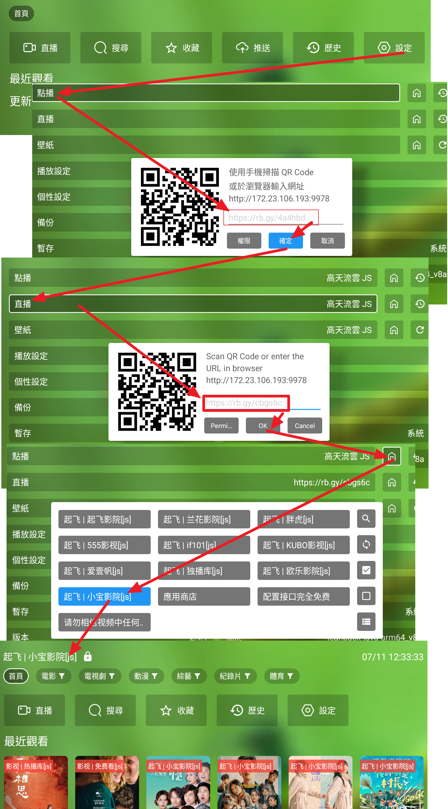

# 蜂蜜 & TVBoxOSC

## 兩大系統："FongMi 蜂蜜與唐三維護: 影視ＴＶ, 蜂蜜影視"　與　"TVBoxOSC"　基礎概念
1. 接口　（源）－＞線路－＞站源　（一個接口可以包含很多線路，一個線路可以包含很多站源）
   1. 搜尋時，可以會自動搜尋同一個線路的所有站源的片
   2. 片上長按，可以搜尋所有站源的片
   3. ＂蜂蜜＂影視ＴＶ系列的下游播放器，　如: 寶盒，西夏，開心，天微，木魚，猫TV，春盈天下，三林，欧歌，星辰...
   4. 每條線路有自己的歷史記錄
2. 推薦：　蜂蜜影視ＴＶ　與　ＯＫＴＶ．　同Fongmi蜂蜜系列，支援注音輸入，直播多線路選擇，有英文，繁中，簡中選項，支援直播多線、自動換源、直播倍速，Ai去廣告等功能，手機投影螢幕等　https://xhdwc.tk/ or https://github.com/FongMi/Release or https://github.com/FongMi/TV
3. 常見版本：　https://github.com/dlgt7/TVbox-interface/blob/main/tvbox%E5%B8%B8%E8%A7%81%E7%89%88%E6%9C%AC.md
4. https://www.wmdz.com/tvboxFM.html (List of many apps)

## 安裝方式：
1. 電視上先裝 downloader. https://www.aftvnews.com/downloader/
2. 然後使用短碼383716，裝emotn商店 
3. 啟動 emotn輸入分享碼 emotn 分享碼796233 
4. 安裝 OK影視 或 影視TV

## 點播接口：
1. Rob Yang 點播倉庫.: https://rb.gy/4s4hbd or https://github.moeyy.xyz/https://raw.githubusercontent.com/bobyang3/TVRelated/master/TVBoxOSC/liveVodTV.json
2. 寶盒=欧乐,泥巴　https://raw.githubusercontent.com/guot55/yg/main/pg/jsm.json
3. 泥巴,独播库,小宝,欧乐,腐剧　https://github.moeyy.xyz/https://raw.githubusercontent.com/qist/tvbox/master/jsm.json (https://github.com/qist/tvbox)
4. https://raw.githubusercontent.com/gaotianliuyun/gao/master/js.json （https://github.com/gaotianliuyun/gao/tree/master） 
7. http://home.jundie.top:81/top98.json
8. https://github.moeyy.xyz/https://raw.githubusercontent.com/jake3737/tvbox/master/js.json 
9. 教學 https://gitlab.com/xmbjm/omg/-/raw/main/omg.json
10. 欧乐,泥巴 (online js) https://gitlab.com/-/snippets/2343779/raw/main/snippetfile1.txt
11. 18 AV https://d.kstore.space/download/7708/a18.json
    

## 直播接口： 
1. Rob Yang 直播倉庫: https://rb.gy/cbgs6c or https://github.moeyy.xyz/https://raw.githubusercontent.com/bobyang3/TVRelated/master/TVBoxOSC/liveTV.json  
2. Rob Yang 直播: https://rb.gy/fmlb89 or https://github.moeyy.xyz/https://raw.githubusercontent.com/bobyang3/TVRelated/master/TVBoxOSC/liveTV.json  
3. 4GTV live: https://api2.4gtv.tv/Channel/GetChannelBySetId/1/pc/L 
4. 159169 http://www.52sw.top:678/play/oj1381/list.php?get=159169
5. 169 http://www.52sw.top:678/play/oj1381  
6. https://www.juwanhezi.com/more/live 

## 接口List：
1. https://www.upx8.com/4021
2. https://xn--qoqw77q.top/dcjk.html
3. http://www.52sw.top:678/play/oj1381/index.php?get=159169
4. https://tianyastudio.blogspot.com/search/label/TV 
5. https://github.com/li5bo5/TVBox?tab=readme-ov-file
6. International: https://iptv-org.github.io/iptv/index.m3u (https://github.com/iptv-org/iptv)

## 特別解析json:
1. https://github.com/wnddwc/daiweichun

## PG包　（本地包）：
1. https://github.com/gaotianliuyun/gao/tree/master

## 如何為影視倉設定內建來源介面？

1. https://tianyastudio.blogspot.com/search/label/TVBOX
2. https://www.youtube.com/watch?v=WI9dwvzNBkY

-----

## TVbox Info:

1. https://github.com/FongMi/TV
2. http://m.wmsio.cn/nd.jsp?mid=324&id=30&groupId=0
3. https://github.com/qist/tvbox

## Emoji:
1. https://emojiterra.com/
2. https://emojipedia.org/

## 直播網站：
1. 電視直播：http://tonkiang.us/
2. 夜視直播：https://yeslivetv.com/
3. 港台直播(VPN)：www.stream-link.org/
4. https://www.ofiii.com/channel/watch/4gtv-4gtv040

--------------------------------------------------------------------

## 其他:
1.  txt m3u 轉換工具 https://guihet.com/tvlistconvert.html
2.  Other link Source https://beatsingdrama.blogspot.com/p/xt-playlist-txt.html?m=1
3.  Emotn: 796233, 202096, 
4.  downloader App https://www.aftvnews.com/downloader/, 383716 to download emotn 

--------------------------------------------------------------------

格式說明 http://www.sharerw.com/a/ziyuan/444.html:
1. 《分享者tv》 《百川影音》自定义直播源的分类写法为: ### $c_start央视$c_end
2. 《DIYP影音》《视米趣播》: ### 央视,#genre#
3. 節目名,地址1#地址2,epg-id(比如CCTV1它的ID是cntv-cctv1) : 工具: http://epg.51zmt.top:8000/

    即在原來的播放列表的每一個項後面加上EPG-ID，舉個例子: 
    
CCTV-1HD,http://stream.guihet.com/hd/ccav1.m3u8,cntv-cctv1

CCTV-1HD,http://stream.guihet.com/hd/ccav1.m3u8,tvming-CCTV1HD

